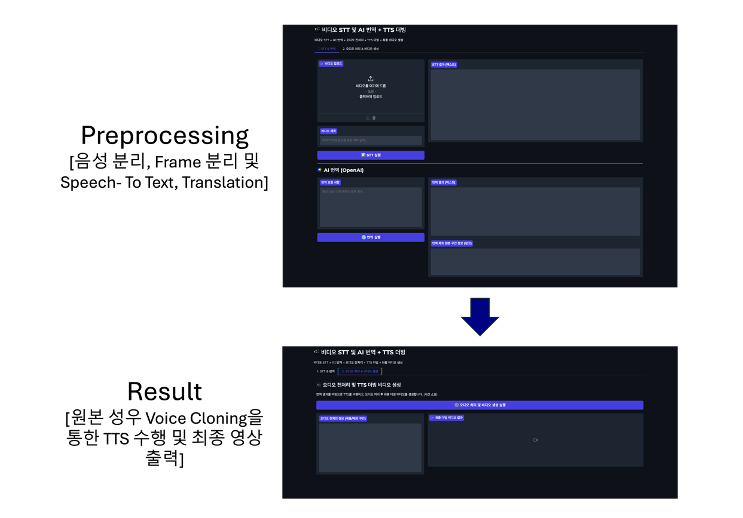

# Zero Shot Voice Cloning for Cross Language Content Delivery
### Abstract
When watching foreign content, dubbing reduces immersion due to voice disharmony and awkward dialogue, while subtitles cause visual distraction and increased fatigue. These issues prevent the complete transmission of the original work's intentions and emotions.
This project has developed an AI voice translation system utilizing deep learning-based Zero Shot technology that preserves the original voice actor's vocal characteristics while translating into different languages. To overcome the limitations of traditional dubbing and subtitles, the system is designed to maintain the original voice's characteristics and emotions while providing natural translation. This system reduces visual distractions so viewers can become more immersed in the content, allowing the original work's intentions and emotions to be properly conveyed.
Expected benefits include providing a content consumption experience without language barriers, improving access to international content, and facilitating exchange between diverse cultures. This is expected to make significant contributions to effective localization and distribution of content in the global media market.

---

### 👪 Team Members
김태민|고혜정|서준혁
:-:|:-:|:-:|
</img>|</img>|</img>|
||
|||

---

<h3> ⚙️ Architecture </h3>
<table>
  <tr>
    <td></td>
  </tr>
</table>

---

<h3> 🎥 Gradio Interface </h3>
<table>
  <tr>
    <td></td>
  </tr>
</table>
