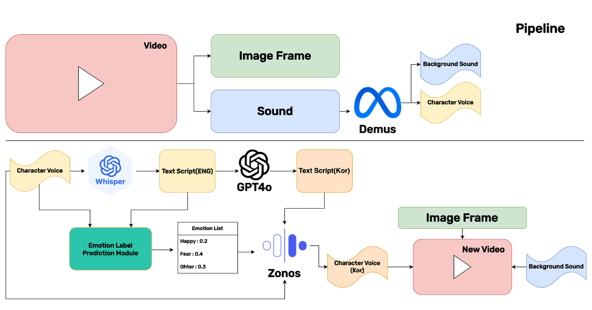

# Zero-Shot Voice cloning 기술을 활용한 영상 번역 시스템

## ⌘ 서비스 아키텍처
<table>
  <tr>
    <td></td>
  </tr>
</table>

 

## 🚩 프로젝트 개요

본 프로젝트는 딥러닝 기반 Zero Shot Voice Cloning 기술을 활용한 AI 음성 번역 시스템입니다. 외국 콘텐츠를 시청할 때 더빙의 음성 부조화와 자막의 시각적 방해 요소를 해결하여, 원작의 의도와 감정을 온전히 전달하는 혁신적인 해결책을 제공합니다.
이 시스템은 원래 성우의 음성 특성과 감정을 유지하면서 자연스러운 번역을 제공하는 AI 기술을 핵심으로 합니다. Zero Shot 학습 방식을 통해 다양한 언어와 음성 특성에 유연하게 대응하며, 기존 더빙과 자막의 한계를 극복합니다. 원본 음성의 톤, 억양, 감정적 뉘앙스를 분석하여 번역 과정에서도 이를 보존하고, 시청자의 몰입도를 극대화합니다.
사용자는 시각적 방해 없이 콘텐츠에 완전히 몰입할 수 있으며, 언어 장벽 없는 자연스러운 시청 경험을 누릴 수 있습니다. 이는 국제 콘텐츠에 대한 접근성을 크게 향상시키고, 다양한 문화 간 교류를 촉진하여 글로벌 미디어 시장에서 효과적인 콘텐츠 현지화와 배급에 중요한 기여를 할 것으로 기대됩니다.

### 🎯 목표 및 동기

* **배경**: 글로벌 콘텐츠 소비가 급증하면서 언어 장벽으로 인한 시청 경험의 제약이 심각한 문제로 대두되고 있습니다. 기존 더빙은 원작 성우의 목소리와 감정이 손실되어 몰입도를 저해하고, 자막은 시각적 집중도를 분산시켜 피로감을 증가시킵니다. 이러한 한계로 인해 원작의 진정한 의도와 감정적 뉘앙스가 제대로 전달되지 못하고 있습니다.
* **목표**: 이러한 문제를 해결하기 위해, 원작 성우의 음성 특성과 감정을 그대로 보존하면서도 자연스러운 언어 번역을 제공하는 AI 음성 번역 시스템을 개발했습니다. 시청자가 언어의 제약 없이 원작 그대로의 몰입감 있는 콘텐츠 경험을 누릴 수 있도록 하는 것이 핵심 목표입니다.

### ✨ 주요 차별점
기존의 음성 번역 솔루션인 ElevenLabs와 같은 서비스는 고품질 음성 번역을 위해 유료 구독 모델을 요구하지만, 본 시스템은 딥러닝 기반 Zero Shot 기술을 통해 원작 성우의 음성 특성과 감정을 보존하는 고품질 번역 서비스를 무료로 제공함으로써 누구나 언어 장벽 없이 콘텐츠를 즐길 수 있다는 점에서 차별화됩니다.

## 🌟 주요 기능

*  **실시간 음성 번역**: AI 기반 Zero Shot 기술을 통한 원본 음성 특성 보존 번역.
*  **감정 보존 기술**: CLAP Feature Extractor를 활용한 자체 개발 감정 조절 모듈로 원작 성우의 감정과 톤 유지.
*  **멀티스테이지 처리**: Demucs 음성 분리, Whisper 음성 인식, GPT 번역, ZONOS TTS를 통한 완전한 파이프라인.
*  **원본 음성 특성 분석**: 딥러닝 기반 음성 특성 추출을 통해 성우의 고유한 vocal signature 보존.
*  **고품질 음성 합성**: 감정 조건부 TTS를 통해 번역된 텍스트를 원본과 유사한 감정으로 음성 합성.
*  **무료 서비스**: 고품질 AI 음성 번역 기술을 누구나 접근 가능한 무료 서비스로 제공.
*  **실용적 인터페이스**: 사용자가 쉽게 영상 파일을 업로드하고 번역 결과를 확인할 수 있는 직관적 UI.

## 🧑🏻‍💻 팀 소개: "한잔해"

**"한성대학교 지능시스템 트랙에서 모인 캡스톤 디자인 팀 `한잔해`"**

### 👨🏼‍💻 팀원

김태민|고혜정|서준혁
:-:|:-:|:-:|
</img>|</img>|</img>|
||
|||

## 🛠️ 기술 스택

*   **개발환경**: Mac OS, Google Colab
*   **개발도구**: Visual Studio Code, Jupyter Notebook
*   **개발언어**: Python
*   **음성 처리 파이프라인**:
    *   **음성 분리**: Demucs (음성과 배경음 분리)
    *   **음성 인식**: Whisper (Speech-to-Text)
    *   **번역**: GPT API (다국어 번역)
    *   **음성 합성**: ZONOS (Text-to-Speech)
*   **감정 모듈 학습**:
    *   **음성 및 텍스트 특성 추출**: CLAP (Contrastive Language-Audio Pre-training) Feature Extractor
    *   **감정 모듈**: 자체 개발 Emotion Conditioning Module
    *   **Zero Shot Labeling**: Gemini
*   **핵심 라이브러리**: HuggingFace, PyTorch, Transformers
*   **음성 처리**: librosa, soundfile
*   **데이터 처리**: NumPy, Pandas

## 💿 데이터 제작 출처 및 평가 정보

이 프로젝트의 일부(팁 토론 또는 미세 조정/평가를 위한 리뷰와 관련될 가능성이 높음)에 사용된 데이터 세트는 다음에서 찾을 수 있습니다:

[Hugging Face의 Reddit 팁 데이터 세트 컬렉션](https://huggingface.co/collections/kfkas/reddit-tip-dataset-681f42af40cff65d89153c88)

### 데이터 수집 및 필터링 과정

| 단계 | 설명 | 데이터 수 |
| :--- | :--- | :---: |
| **데이터 수집** | **Web Scraping (Beautiful Soup)** | - |
| | Reddit 팁 사례 데이터 2000개 수집 | 2000개 |
| **1차 필터링** | LLM으로 상황 Caption, Tip이 있는 샘플만 필터링 | 533개 |
| **2차 필터링** | 상황 Caption과 Tip이 일관성 있는 샘플만 필터링 | 338개 |
| **데이터 생성 (Gemini)** | Situation Caption을 입력으로 손님 입장에서의 Video 캡션 생성, 내용 일관성 있는 샘플만 필터링 | 112개 |
| **3차 필터링** | Situation Caption과 Video Caption 상황이 일치하는 샘플만 필터링 | 105개 |
| **최종 데이터** | **최종 Reddit Tip 데이터 생성 (Video Caption, Tip %)** | **105개** |
