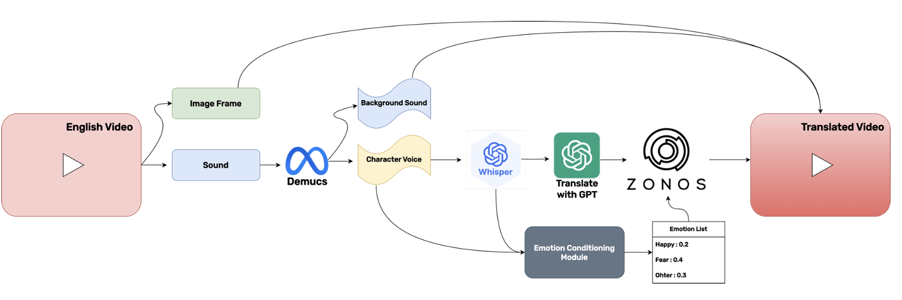

# Zero-Shot Voice cloning 기술을 활용한 영상 번역 시스템

## ⌘ 서비스 아키텍처
<table>
  <tr>
    <td></td>
  </tr>
</table>

 

## 🚩 프로젝트 개요

본 프로젝트는 딥러닝 기반 Zero Shot Voice Cloning 기술을 활용한 AI 음성 번역 시스템입니다. 외국 콘텐츠를 시청할 때 더빙의 음성 부조화와 자막의 시각적 방해 요소를 해결하여, 원작의 의도와 감정을 온전히 전달하는 혁신적인 해결책을 제공합니다.
이 시스템은 원래 성우의 음성 특성과 감정을 유지하면서 자연스러운 번역을 제공하는 AI 기술을 핵심으로 합니다. Zero Shot 학습 방식을 통해 다양한 언어와 음성 특성에 유연하게 대응하며, 기존 더빙과 자막의 한계를 극복합니다. 원본 음성의 톤, 억양, 감정적 뉘앙스를 분석하여 번역 과정에서도 이를 보존하고, 시청자의 몰입도를 극대화합니다.
사용자는 시각적 방해 없이 콘텐츠에 완전히 몰입할 수 있으며, 언어 장벽 없는 자연스러운 시청 경험을 누릴 수 있습니다. 이는 국제 콘텐츠에 대한 접근성을 크게 향상시키고, 다양한 문화 간 교류를 촉진하여 글로벌 미디어 시장에서 효과적인 콘텐츠 현지화와 배급에 중요한 기여를 할 것으로 기대됩니다.

### 🎯 목표 및 동기

* **배경**: 글로벌 콘텐츠 소비가 급증하면서 언어 장벽으로 인한 시청 경험의 제약이 심각한 문제로 대두되고 있습니다. 기존 더빙은 원작 성우의 목소리와 감정이 손실되어 몰입도를 저해하고, 자막은 시각적 집중도를 분산시켜 피로감을 증가시킵니다. 이러한 한계로 인해 원작의 진정한 의도와 감정적 뉘앙스가 제대로 전달되지 못하고 있습니다.
* **목표**: 이러한 문제를 해결하기 위해, 원작 성우의 음성 특성과 감정을 그대로 보존하면서도 자연스러운 언어 번역을 제공하는 AI 음성 번역 시스템을 개발했습니다. 시청자가 언어의 제약 없이 원작 그대로의 몰입감 있는 콘텐츠 경험을 누릴 수 있도록 하는 것이 핵심 목표입니다.

### ✨ 주요 차별점
기존의 음성 번역 솔루션인 ElevenLabs와 같은 서비스는 고품질 음성 번역을 위해 유료 구독 모델을 요구하지만, 본 시스템은 딥러닝 기반 Zero Shot 기술을 통해 원작 성우의 음성 특성과 감정을 보존하는 고품질 번역 서비스를 무료로 제공함으로써 누구나 언어 장벽 없이 콘텐츠를 즐길 수 있다는 점에서 차별화됩니다.

## 🧑🏻‍💻 팀 소개: "한잔해"

**"한성대학교 지능시스템 트랙에서 모인 캡스톤 디자인 팀 `한잔해`"**

### 👨🏼‍💻 팀원

김태민|고혜정|서준혁
:-:|:-:|:-:|
</img>|</img>|</img>|
||
|||

## 🛠️ 기술 스택

*   **백엔드**: Python, Flask
*   **프론트엔드 (UI)**: Gradio
*   **머신러닝 / AI**:
    *   **팁 계산/분석 LLMs**: Google Gemini API, Ollama (Mistral 등 로컬 모델), Qwen (Tongyi Qwen API), OpenAI GPT API
    *   **이미지/비디오 분석 VLMs/Image-Text Models**: HuggingFace SmolVLM (`HuggingFaceTB/SmolVLM2-256M-Video-Instruct`), Google SIGLIP (`google/siglip2-base-patch16-384`), Gemini API (멀티모달 입력), Qwen-VL-Plus API (멀티모달 입력)
    *   **라이브러리**: PyTorch, Transformers, OpenCV, Pillow (PIL)
*   **웹 스크레이핑**: Selenium, `webdriver-manager` (Google 리뷰용)
*   **데이터 처리**: Pandas
*   **로깅**: 표준 Python `logging` 모듈
*   **병렬 처리**: `concurrent.futures.ThreadPoolExecutor` (비디오 처리 등)

<h3> 🎥 Gradio Interface </h3>
<table>
  <tr>
    <td></td>
  </tr>
</table>
